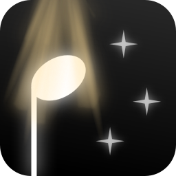

# Cadenzier

The free and open-source music notation editor you've been waiting for.

## Planned features

- Fully FOSS, forever.
- All features fully accessible by or even designed for the keyboard.
- Professional quality rendering/engraving via [LilyPond].
- Gorgeous audio via [Sfizz] and the [VSCO 2: CE] SFZ library.
- A modern interface and backend, powered by Rust and the [iced] crate.
- Priority given to the offline experience, and not the cloud.

**Please note that this project is in its early stages, and that there is little to show yet.**

You can [read the docs][Docs] for more info about the project.

[LilyPond]: https://lilypond.org/
[Sfizz]: https://sfztools.github.io/sfizz/
[VSCO 2: CE]: https://versilian-studios.com/vsco-community/
[iced]: https://iced.rs/
[Docs]: https://twilit-jack.codeberg.page/cadenzier/
